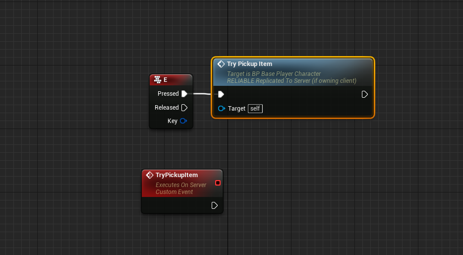
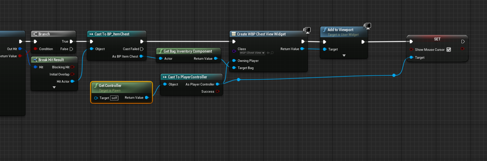

# Maniuplating Items inside and outside of your Inventory

## Swapping Slots

The Primary method to swap items is to activate the built in Swap Item Slots Ability.  This is stored in the ArcInventoryContent folder in your content browser.  

!!! note
    If you do not see it, you will need to click the little eyeball and enable "Show Plugin Content" and "Show Engine Content"

Swapping Items is done by setting, on the client, the `SwapToSlot` and `SwapFromSlot` on the Inventory component, and then activating the ability.  The Ability will then synchronize the FromSlot and ToSlot to the server, and execute the `SwapItemSlots` function.  This is predicted on the local client, so feedback is instant.

!!! note
    The default Item Slot Widget will try to activate abilities by the Swap Item Slot tag in the Project settings.  If you cannot get item swapping working, check that your character has that ability, and that tag is set in the project files, and that tag is part of the Ability Tags in the Swap Item Slot ability.  

    If you are writing your own UI, it is recommended that you set the `SwapToSlot` and `SwapFromSlot` properties and then call the ability.  

!!! tip
    It is recommended that you copy the Swap Item Slots ability out of the plugin and into your project.  Games may need more rules around swapping item slots, and modifying an asset in the plugins folder can be dangerous.

    You can also create your own SwapItemSlots ability if you want to use your own replication method

## Dropping Items

Included in the plugin is an ability that will drop an item from an item slot.  This Ability handles all dropping of items by replicating the slot to the server, removing the item from the inventory in that slot, and then spawning a "World Item" with that stack as part of it (See [Item Stack Concepts](../../concepts/itemstack/#world-stacks) for more information).

The removal of items from your inventory is not predicted.  In high latency environments, you will have a delay between the user attempting to drop the item, and the item being removed from the inventory and spawning in the world.   

!!! note
    The Default Item Slot Widget will attempt to drop an item into the world if the drag and drop operation ends without an underlying Item Slot Widget.  This is done by activating any ability on the owning character with the `Item Slot Drop Ability Tags`.  As with Swapping, ensure that your character has this ability, that tag is set in the project settings, and the ability has it in it's Ability Tags.

    If you are writing your own UI, it's recommended that you set the `PendingItemDrop` property in Inventory and call the ability by tag.  

!!! tip
    As with the Swap Item Slots ability, it is recommended that you copy this ability out of the plugin and into your project.

    Also as with the Swap Item Slots ability, you can create your own if you need to.

## Pick up an item

Picking Up an item is not provided by default in Arc Inventory

There are many methods to achieve this, but I will do a simple one for this tutorial that is not predicted.

In your character blueprint, Bind an event to `Input E`.  Create another event called `TryPickupItem`.  Set it to Run On Server, and check the Reliable button.  Call `TryPickupItem` in the Pressed event from Input E.  

In TryPickupItem, call `Line Trace By Channel`.  Set the Start point to be your Camera's world location and the end point to be some point 400 units in front of the camera, using the forward vector from the character's aim angles.  Set your character to be an Ignore actor.  

Check the results of this line trace.  If we hit a target, break the hit result and grab the actor.  Cast it to Arc `Inventory World Stack Actor`.  Grab the item stack in it and call `Loot Item` on our Inventory with that item stack.

If the item was successfully looted, Destroy the World Stack Actor.  

You now have the item in your inventory.

!!! tip
    This process can be put into an ability, and every part can be predicted, except for the destroying the world stack actor.  

## Create A Container

Any Actor can hold an Inventory Component.  Item Stashes or Chests are a good example of an actor that can hold many items.

### Create a Container Actor

To Start, Create a new Actor, which we will call `BP_ItemChest`.  Give that Actor some visuals (a white Cube will suffice) and a Bag Inventory component.  Give the Bag 12 slots.

!!! warning
    In Multiplayer, ensure that the actor replicates and the inventory component replicates!

Place this actor in the world.  This is our stash that will hold our items.  

### Create a View Widget
Now, we need to be able to inspect it.  We must create a UMG widget to view this container.  Create a new widget that we'll call `WBP_ChestView`.  Lay out the widget however you want, but I went with a simple black border.  

In the content of the widget, Add in a `BP_InventoryBagWidget` to your widget.  This widget will display the contents of any Bag Inventory.  

Tab over to the Graph for the widget, and create a new variable of type `ArcInventoryComponent_Bag` and name it `Target Bag`.  Check `Instance Editable` and `Expose on Spawn`.

In the Construct node, set the InventoryBagWidget's `Bag Inventory` property to your newly created variable.  This will target the bag view to look at whichever target we give it.

!!! info
    I also added a "Close" button to my widget, that removes the widget from parent.  You may want to control interaction differently.

### Interaction

Next, we need to interact with a chest to view it's contents.  In your player, create a new input button for viewing the widget.  Similar to the Pickup Item, we need to line trace forward to see if we are looking at a chest.

Do what you did for line tracing, but this time cast to `BP_ItemChest`

Once you have the chest, get it's bag inventory component and create a `Create Widget` node.  Set the class to `WBP_Chest View`, set the owning player to our player controller, and set the `Target Bag` to the Chest's bag component.  Add this component to viewport, and then activate the mouse cursor.

 

You should now see the contents of the chest!

### Transfer Items between Two Inventories

!!! note
    This feature requires ArcInventory 1.2.3 or greater.  

Simply dragging the item between your inventory and the target inventory should work via Drag and Drop.

The Inventory takes any two inventory slots to transfer items to/from.  So long as one of the slotrefs reference a slot in the player's inventory, it will swap between the two inventories.  

!!! caution
    The default implementation does not check if a player should be transferring items between two inventories.  It is up to you to implement these checks

--8<-- "includes/abbreviations.md"