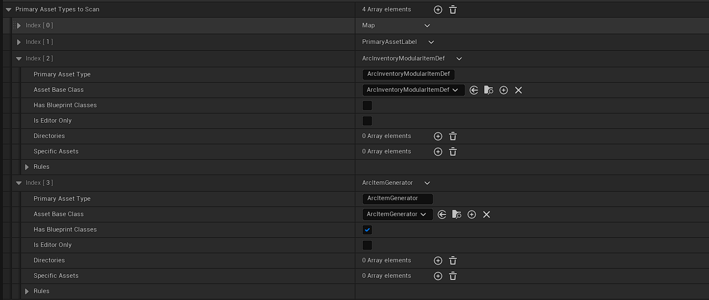

# Initial Setup

Thanks for purchasing Arc Inventory!  Once you've downloaded the plugin and enabled it in your project, this is how you start to use it!

!!! info 
    This plugin uses a lot of other Unreal Engine concepts to achieve full functionality.  It's recommended that you have a firm grasp on Unreal Engine, GAS, and Gameplay Tags

    * [GASDocumentation](https://github.com/tranek/GASDocumentation)
    * [Unreal Engine Gameplay Tag documentation](https://docs.unrealengine.com/en-US/ProgrammingAndScripting/Tags/index.html)

## Adding the plugin to your project

There are two methods to add the plugin to your project, one for if you use the Epic provided launcher build, and one if you use a github source build

=== "Launcher Build"
    The Unreal Engine launcher will place the plugin in the Engine/Plugins/Marketplace folder.  For a majority of people this is ideal.  ArcInventory will automatically activate.

    If you wish to make custom modifications to ArcInventory, it is recommend you copy the plugin out of the Engine/Plugins/Marketplace folder and place it in your game's Plugins/ directory.      

=== "Source Build"
    If using a source build from github or Epic's perforce, you must first download the plugin from the Unreal Engine marketplace.  You must have a launcher version installed to download it for that engine version, but you don't need to use it.

    Once downloaded, you need to copy the plugin from your Engine/Engine/Plugins/Marketplace folder and place it in your game project's Projects/ folder.  

    After that, Arc Inventory should build and be available to your game.


!!! note
    For a C++ project, you need to add ArcInventory to your game module's build.cs file.  Simply add `"ArcInventory"` to the `PublicDependencyModuleNames` in your game module's .build.cs file.  

## Optional: Configuring the Asset Manager

Arc Inventory supports the Asset Manager to dynamically load items!  To set that up, you simply need to configure the Primary Asset Types for the Arc Inventory types.

=== "Editor"
    In the Unreal Editor, go to View -> Project Settings.  Select the **Asset Manager** category within Game.

    Add two entries in the `Primary Asset Types to Scan` array, and set them to be the following information:

    

=== ".ini"
    In your `DefaultGame.ini`, add the following tags to the `[/Script/Engine.AssetManagerSettings]` section (Create it if it doesn't exist)

    ```
    +PrimaryAssetTypesToScan=(PrimaryAssetType="ArcItemGenerator",AssetBaseClass=/Script/ArcInventory.ArcItemGenerator,bHasBlueprintClasses=True,bIsEditorOnly=False,Directories=((Path="/Game")),SpecificAssets=,Rules=(Priority=-1,ChunkId=-1,bApplyRecursively=True,CookRule=Unknown))
    +PrimaryAssetTypesToScan=(PrimaryAssetType="ArcInventoryModularItemDef",AssetBaseClass=/Script/ArcInventory.ArcInventoryModularItemDef,bHasBlueprintClasses=false,bIsEditorOnly=False,Directories=((Path="/Game")),SpecificAssets=,Rules=(Priority=-1,ChunkId=-1,bApplyRecursively=True,CookRule=Unknown))
    ```

!!! note
    When to load asset data and best practices around the Asset Manager is out of scope for this documentation, but for development it is often easy to just load all assets of these types at game startup.  


--8<-- "includes/abbreviations.md"