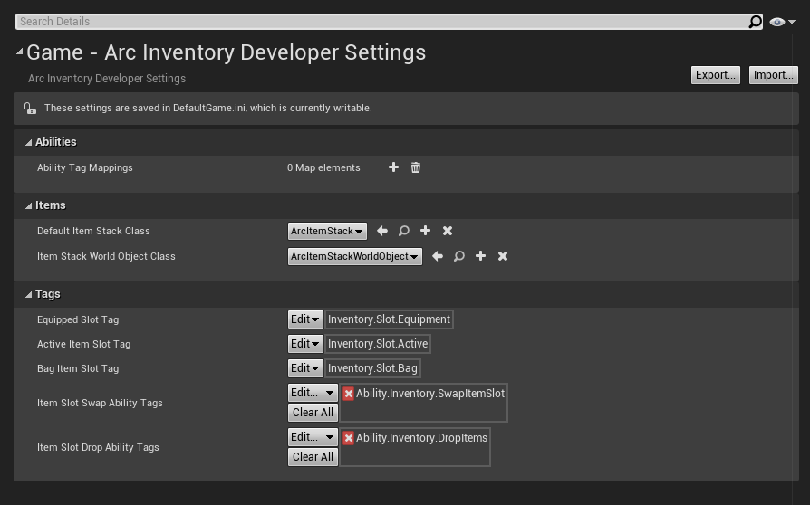

# Initial Setup

Thanks for purchasing Arc Inventory!  Once you've downloaded the plugin and enabled it in your project, this is how you start to use it!

!!! info 
    This plugin uses a lot of other Unreal Engine concepts to achieve full functionality.  It's recommended that you have a firm grasp on Unreal Engine, GAS, and Gameplay Tags

    * [GASDocumentation](https://github.com/tranek/GASDocumentation)
    * [Unreal Engine Gameplay Tag documentation](https://docs.unrealengine.com/en-US/ProgrammingAndScripting/Tags/index.html)


### Optional: Configuring the Asset Manager

Arc Inventory supports the Asset Manager to dynamically load items!  To set that up, you simply need to configure the Primary Asset Types for the Arc Inventory types.

=== "Editor"
    In the Unreal Editor, go to View -> Project Settings.  Select the **Asset Manager** category within Game.

    Add two entries in the `Primary Asset Types to Scan` array, and set them to be the following information:

    

=== ".ini"
    In your `DefaultGame.ini`, add the following tags to the `[/Script/Engine.AssetManagerSettings]` section (Create it if it doesn't exist)

    ``` ini
    +PrimaryAssetTypesToScan=(PrimaryAssetType="ArcItemGenerator",AssetBaseClass=/Script/ArcInventory.ArcItemGenerator,bHasBlueprintClasses=True,bIsEditorOnly=False,Directories=((Path="/Game")),SpecificAssets=,Rules=(Priority=-1,ChunkId=-1,bApplyRecursively=True,CookRule=Unknown))
    +PrimaryAssetTypesToScan=(PrimaryAssetType="ArcItemDefinition_New",AssetBaseClass=/Script/ArcInventory.ArcItemDefinition_New,bHasBlueprintClasses=True,bIsEditorOnly=False,Directories=((Path="/Game")),SpecificAssets=,Rules=(Priority=-1,ChunkId=-1,bApplyRecursively=True,CookRule=Unknown))
    ```

!!! note
    When to load asset data and best practices around the Asset Manager is out of scope for this documentation, but for development it is often easy to just load all assets of these types at game startup.  

### For UE 4.26, Configuring Arc Inventory

!!! note
    As of Unreal Engine 4.27, Configuring Arc Inventory is no longer needed.  If you use previous version of Arc Inventory, this section is still necissary.


Your first step will be to configure the necissary tags for Arc Inventory's internal functions.  These are required, and many features will fail to function if these tags are not configured.  

=== "Editor"
    In the Unreal Editor, go to View -> Project Settings.  Select the **Arc Inventory Developer Settings** category within Game.

    

    !!! bug "Deprecation Notice"
        `Ability Tag Mappings` is deprecated and unused.  It will be removed in future versions of Arc Inventory


=== ".ini"
    in `DefaultGame.ini` the you can configure the following fields with tags:

    ``` ini 
    [/Script/ArcInventory.ArcInventoryDeveloperSettings]
    EquippedSlotTag=(TagName="Inventory.Slot.Equipment")
    ActiveItemSlotTag=(TagName="Inventory.Slot.Active")
    BagItemSlotTag=(TagName="Inventory.Slot.Bag")
    ItemSlotSwapAbilityTags=(GameplayTags=((TagName="Ability.Inventory.SwapItemSlot")))
    ItemSlotDropAbilityTags=(GameplayTags=((TagName="Ability.Inventory.DropItems")))
    ```

    !!! warning
        Ensure that the tags are defined in your `GameplayTags.ini` or however else you've configured gameplay tags!


Once the tags are configured, the Plugin is setup and ready to go!  You are ready to add the Inventory Component to your player!

--8<-- "includes/abbreviations.md"